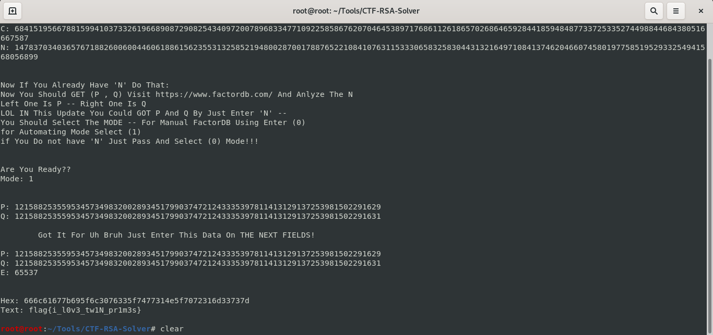

# CTF-RSA-Solver
**A Tool Written In Python Solve CTF RSA Challenges**
# Download And Install This Tool
```
git clone https://github.com/DEMON1A/CTF-RSA-Solver.git
cd CTF-RSA-Solver
python2 RSA_Solver.py
```
# Usage
### Modes:
- **For Manual Mode To Get (P,Q) Select (0)**
- **For Automating Mode To Get (P,Q) From FactorDB Using Requests And BS4 Select (1)**
### Basic :
- **Put Flag Format To Filter Brute Force Result**
- **Put 'C' That The Challenge Given You**
- **Put 'N' That The Challenge Given You**
- **Visit FactorDB To Ananlyze 'N' And Enter (P , Q)**
- **Enter 'E' KEY To Start Decrypt It**

### Advanced :
- **If You Do Not Know 'N' You Could Leave It Empty And Add (P , Q) And The Program Will Calculate 'N'**
- **If You Do Not Know 'E' You Could Use BruteForce With Any Limit!**
- **If You Will Not Use BruteForce For 'E' It Is Not Necessary To But FlagFormat**

## Tips
- **When It Show You Found Possible Result Click 'Enter' TO Show It**
- **The Best Limit For CTFs Is '100000'**
- **Brute Force Can Not Work Without The FlagFormat If You Do Not Know It Ask The CTF Admin**
- **If There Is No Stable FlagFormat You Could Try {flag , ctf , CTF , FLAG}**
- **For CTFlearn The Most Common Flag Formats Is {CTFlearn , flag , FLAG , abctf , ABCTF}**
- **Check Your Python Version Using ```python -V``` This Tool Can Run Only On Python2**
- **If You Are Using Kali Linux U Will Find Both Python2 And Python3 On Your Device Run This Tool With ```python2 RSA_Solver.py```**
- **Feel Free To Open an Issue Or Edit The Tool**
- **If There Is Any Thing You Wanna Me To Add Just Contact Me**
- **You Could Run This Tool On Any Operation System You Just Need Python2**

## What's New?
- **Clean Code**
- **Automating GET (P,Q) From 'N' Using FactorDB**

## Issues
- **Error:**
```
ImportError: DLL load failed: The specified module could not be found Crypto.Util.number
```
- **Solution:**
```
pip2 install pycryptodome
```
- **Error:**
```
Auto Mode Pring (P , Q) With ... Instead Of The Main Number
```
- **Solution:**
```
Already Solved On The New Update!!!
```
### Contact
- **Email: mdaif1332@gmail.com**

# View

<hr>
