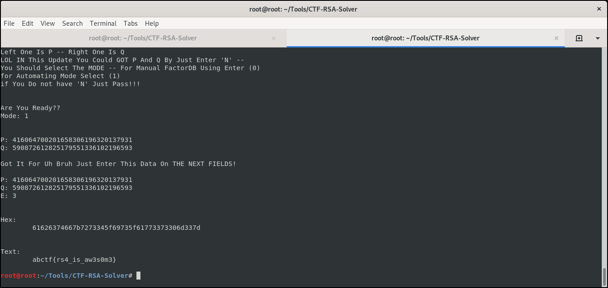

# CTF-RSA-Solver
**A Tool Written In Python Solve CTF RSA Challenges**
# Download And Install This Tool
```
git clone https://github.com/DEMON1A/CTF-RSA-Solver.git
cd CTF-RSA-Solver
python2 RSA_Solver.py
```
# Usage
### Basic :
- **Put Flag Format To Filter Brute Force Result**
- **Put 'C' That The Challenge Given You **
- **Put 'N' That The Challenge Given You**
- **Visit FactorDB To Ananlyze 'N' And Enter (P , Q)**
- **Enter 'E' KEY To Start Decrypt It**

### Advanced :
- **If You Do Not Know 'N' You Could Leave It Empty And Add (P , Q) And The Program Will Calculate 'N'**
- **If You Do Not Know 'E' You Could Use BruteForce With Any Limit!**
- **If You Will Not Use BruteForce For 'E' It Is Not Necessary To But FlagFormat**

## Tips
- **When It Show You Found Possible Result Click 'Enter' TO Show It**
- **The Best Limit For CTFs Is '100000'**

## What's New?
- **Clean Code**
- **Automating GET (P,Q) From 'N' Using FactorDB**

# View

